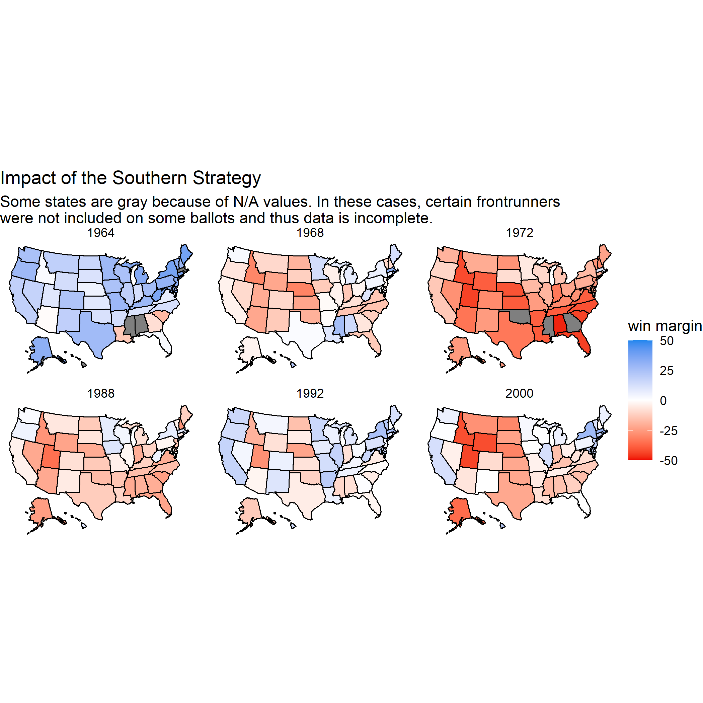

# Population Prejudice: Is The Electoral College Biased Against More Populous States?

In the days following November 8th, 2016, the US electorate was forced to re-examine its complex relationship with a long-criticized institution: the Electoral College. For the fourth time in US history, a presidential candidate who failed to win a plurality of the popular vote had managed to win the Electoral College and thus gain the presidency. Many Democratic voters post-election accused the Electoral College of being biased against traditionally blue states, which they claim tend to be more populous than strongly red-leaning states. This claim stems from the structure of the Electoral College, which allocates at least 3 electors to every state regardless of population.

One commonly cited example is the comparison of Wyoming and California. According to [this NBC News article from 2016](https://www.nbcnews.com/storyline/2016-election-day/electoral-college-lesson-more-voters-chose-hillary-clinton-trump-will-n681701), California has about 69 times as many people as Wyoming, but only about 18 times more electoral votes. This apparent discrepancy is illustrated in the two graphics below, which compare the populations and the number of electors in Wyoming and California in 2016.

In light of this difference, it is interesting to consider how electors are apportioned in the first place. Each state receives a number of electors equal to its sum of Senators and Representatives. Thus, the number of a state’s electors can be a general indicator of the state’s population. This observation raises an interesting question: is there any kind of relationship between population and number of electors per state? More specifically, do the most populous states tend to prefer one party, and has this relationship changed significantly over time? I explore this potential correlation in the animation below, which illustrates what percent of a state’s vote the Democratic presidential candidate received in elections going back to 1948. 

As seen in the graphic, it appears that since 1948 there has been a positive relationship between number of electors and Democratic vote share by state; however, this relationship began very weakly and slowly grew more pronounced. In the earliest years depicted in the animation, the regression line is nearly flat, indicating almost no correlation between Democratic vote percent and number of electors. Later, though, the line turns more clearly upwards, implying that in recent years more populous states have begun voting more strongly Democratic than in the past. 

It is interesting to consider why this trend has remained largely the same over time, though weaker in earlier years. To understandy why there has always been at least a faint relationship between Democratic vote share per state and number of electors, it bears keeping in mind some of the political shifts which occurred over this approximately 70-year period. 

Before the 1970s, the South was generally a stronghold for Democratic candidates. In the 1960 presidential election, John F. Kennedy was carried to victory in large part by a key bloc of Southern states. During this time, populous states in both the North and South voted solidly Democrat, and in the 1964 election, all of the most populous states- New York, California, Texas, Pennsylvania- voted blue. These numbers support the trends shown in the graphic above.

Observing these patterns, Republican strategists in the late 1960s realized that they desperately needed to regain support in Southern states to experience electoral success in the future. To this end, Republican strategists urged presidential candidates like Richard Nixon to take advantage of the divisive issue of race within the South by using polarizing racial rhetoric which could propel white voters out in stronger numbers to vote for Republicans. The tactic worked, and as can be seen in the map below, the South quickly turned from blue states to swing states and ultimately firmly red.

With these strategies and the help of hugely popular presidential candidates like Ronald Reagan, the Republican Party enjoyed control over the White House for over a decade in the 1980s. However, as the graphic shows, even during these periods of Republican power, more populous states such as California and New York voted less strongly for the Republican candidates. In 1992, the election of Bill Clinton marked a new era of Democratic strategy which began winning back key states such as California and New York. By 2000, the electoral map takes a shape remarkably similar to the map of 2016, where the high populations of the Northeast and west coast serve as a sort of "blue wall", while the South is a relatively impermeable red bloc.

Thus, going back to our earliest question, we can observe that there does seem to be a relationship between population within states and tendency to vote Democrat. The question now is whether we can use this information to help us in predicting the results of the 2020 election.