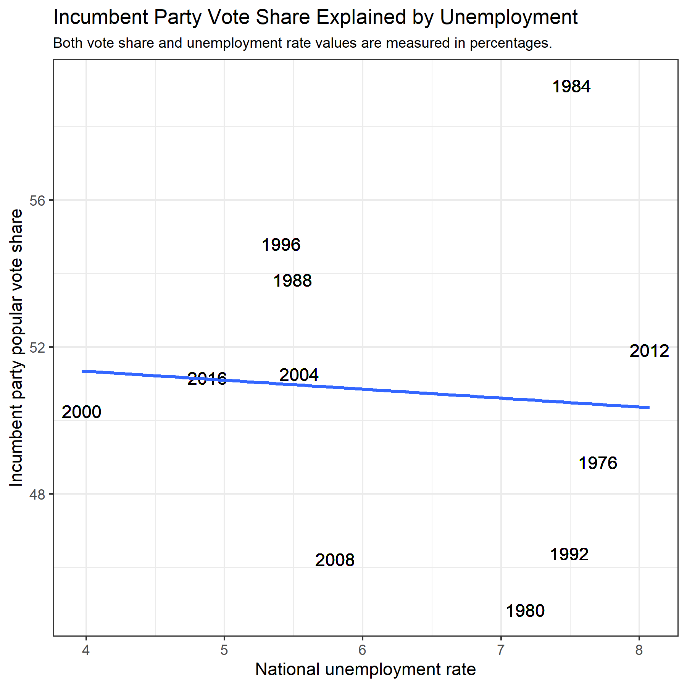
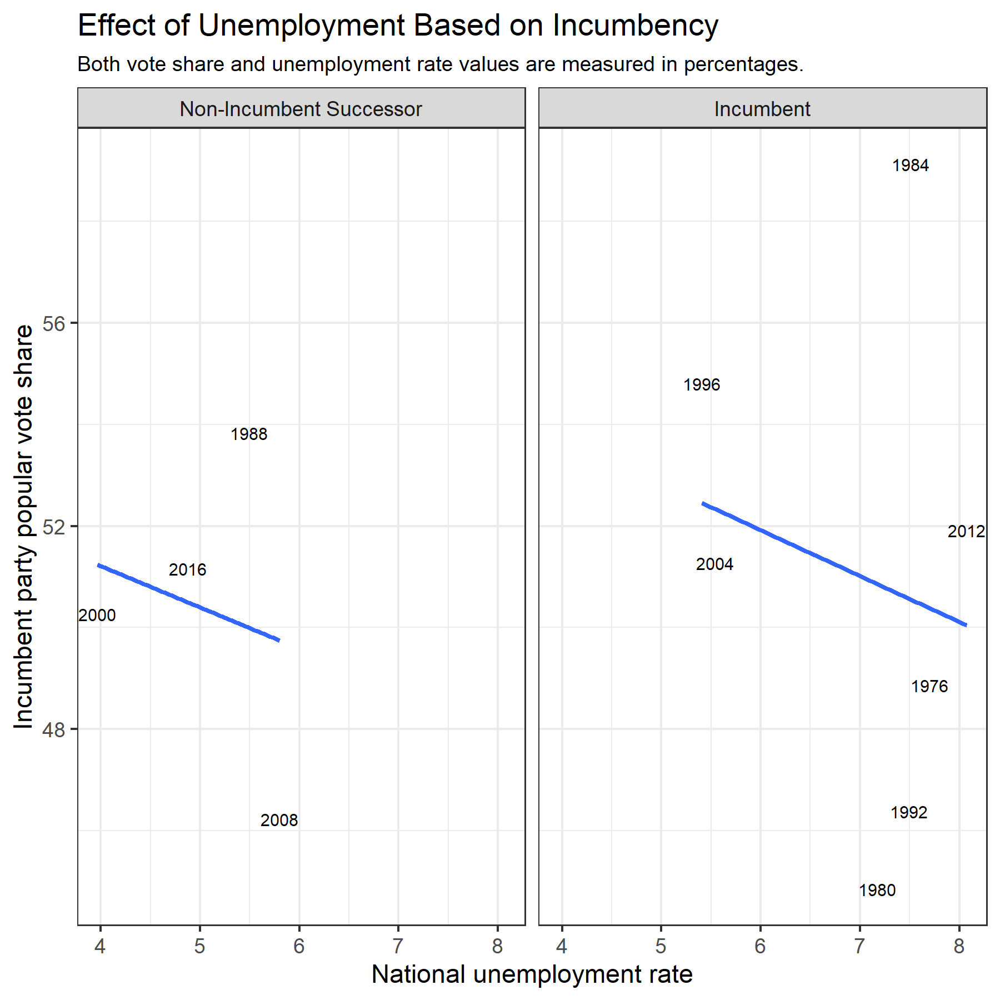
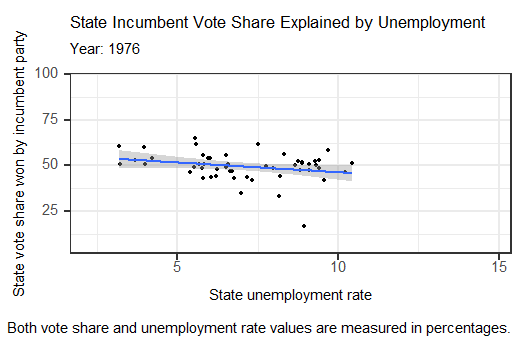
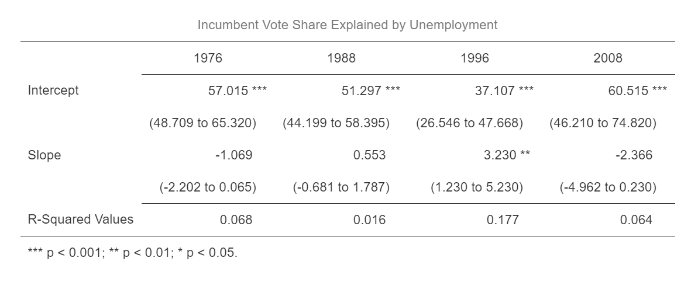
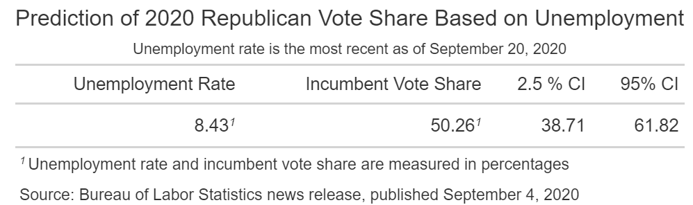

# Voting With Your Wallet- When and How Do Americans Engage in Economic Voting?
## September 20, 2020

Going into an election cycle, one of the most important questions posed by pundits is **how the state of the economy will impact the election**. It is generally believed that various aspects of the economy such as GDP growth, average real disposable income, and unemployment rates all have a role to play in election outcomes.

But if we believe that voters do tend to “vote with their wallets,” this raises a number of questions. First of all, **do these measures of an economy have the same impact when a presidential candidate is an incumbent as when the candidate is a non-incumbent party successor?** If there seems to be a stronger correlation between economic predictors and an incumbent party’s popular vote share when the candidate is an incumbent rather than a successor, this could indicate that voters attribute economic success to individual candidates rather than parties as a whole.

Another interesting question is **whether variables have changed in their predictive power over time.** Has the economy become a better or worse predictor of election results over the past 50 years, or has it remained relatively the same? 

To investigate these questions, there are a wide variety of possible economic predictors that we could include. However, for today I have chosen to only look at unemployment’s impact on elections. The unemployment rate is one of the most heavily discussed topics on the campaign trail. Former Vice President Biden has [blamed President Trump](https://www.usatoday.com/story/news/politics/2020/06/05/joe-biden-slams-trump-spiking-ball-despite-high-unemployment/3153356001/) for not responding strongly enough to rising unemployment during the pandemic. At the same time, President Trump has [touted unemployment drops](https://www.politico.com/news/2020/06/05/may-unemployment-rate-coronavirus-302945) as sign of his administration’s ability to rally the economy. Considering how important unemployment seems to be to both candidates, I will only be exploring unemployment’s power as a predictor today.

## Unemployment as a Predictor of Incumbent Party Vote Share

The graphic shown above illustrates the correlation between national unemployment rates and the percentage of popular vote won by an incumbent party in presidential elections going back to 1976. A simple linear model explaining incumbent party vote share by national unemployment rates shows that there is a **slightly negative relationships between unemployment and incumbent vote share**. The model and graphic indicate that with every 1-percentage point increase in the amount of national unemployment, incumbent party vote share in a presidential election will decrease by approximately 0.24 percentage points. 

While this relationship would generally be expected- higher levels of unemployment probably will not make voters more excited about voting for an incumbent party- **the strength of this relationship is called into question by very low R-squared values**. According to these R-squared values, only about 0.6% of the variation in incumbent vote share can be accounted for by this model. This calls into question the strength of unemployment alone as a predictor of electoral results.

## Unemployment's Impact on Incumbent Candidates vs. Party Successors

Another question I was curious to investigate was **whether unemployment rates had the same impacts on incumbent candidates and non-incumbent party successors.** To visualize this difference, I created another graphic, this time distinguishing between races with incumbent candidates seeking re-election and non-incumbent party successors.

According to the graphic and some summary statistics calculated for each linear model, the **impact of unemployment is roughly the same for both incumbent candidates and non-incumbent successors**. The effect on incumbents is just slightly stronger. With every 1-percentage point increase in unemployment, there is a correlated decrease of about 0.90 percentage points for incumbent candidates, but only about a 0.81 percentage point decrease for non-incumbents. However, this is a relatively minimal distinction, and yet again the **R-squared values found for both models are very small**. This tells us that neither model is particularly good at explaining the variation in incumbent party's vote share.

## Unemployment's Predictive Power Over Time

Though unemployment does not appear to be the best predictor of election outcomes as evidenced by the analysis above, I was interested in exploring whether unemployment has been a better predictor of certain years than others. The animation below shows individual states' various unemployment rates along with the percentage of the state's vote won by the incumbent party.

Interestingly, in 6 out of 11 election years (a slim majority but a majority nonetheless!) the relationship between a state's vote share for the incumbent party and that state's unemployment rate was positive. Thus, **in 6 election years since 1976, higher unemployment rates in individual states were actually correlated with higher vote shares within those states for the incumbent party.** It is important to note, however, that for the election years where this positive relationship was present, the relationship was sometimes very weak. 

To explore this further, I selected election years from each decade that data was available and created models using national unemployment rates to explain incumbent vote share. The results of these regressions are displayed in the table below.

Out of these election years, we see some interesting variations in unemployment's relationship with election outcomes. In 1976 and 2008, there was a negative relationship between incumbent vote share and national unemployment rates, which is the relationship most people would generally expect to see between these variables. However, the table above shows that yet again, the R-squared values for these years are low. 

1988 shows a weakly positive relationship between incumbent vote share and unemployment, but the R-squared value calculated reveals that only 1.6% of the variation in incumbent vote share is explained by this model. 

1996 seems to be a bit of an anomaly because of the relatively strong positive relationship between incumbent vote share and unemployment. In addition to the strength of this relationship, the R-squared value- while still low- is comparatively much higher than previous years analyzed, with 17.7% of the variation in vote share explained.

Considering the variability in unemployment's relationship with incumbent vote share, it **does not seem that unemployment is the greatest predictor of election results.** However, I was still interested to see what a prediction based on unemployment and incumbent vote share since 1976 could reveal about the potential outcome of the 2020 election. The results of that prediction are shown in the table below.

**According to this (very simplistic!) prediction of 2020 election outcomes based solely on unemployment, President Donald Trump would earn 50.26% of the popular vote.** This could be enough to scrape out a narrow victory. However, the 2.5% and 95% confidence intervals for this prediction estimate that **Trump's vote share in the election could be anywhere from about 39% to 62%. That margin is very wide and does not speak well to the predictive power of this model.**

Though it appears that unemployment on its own may not be the best predictor of election outcomes, it is still a significant part of rhetoric on the campaign trails. Perhaps in combination with other economic factors such as GDP growth and real disposable income, models can use unemployment as one variable among others to more accurately predict election results.
