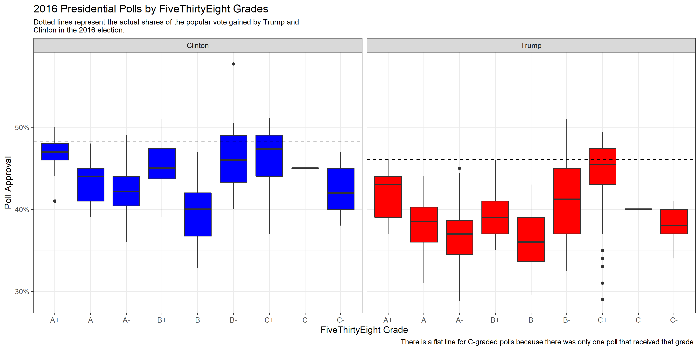

# Polling- Predictive or Problematic?

After Donald Trump's unexpected win in the 2016 election, political pundits, reporters, and politicians have spent excessive amounts of time attempting to understand how 2016 pollsters got the last election's results so ["wrong."](https://www.pewresearch.org/fact-tank/2016/11/09/why-2016-election-polls-missed-their-mark/) In the run-up to the 2020 election, analysts have been more cautious in taking poll results at face value than perhaps ever before. Many pundits have attempted to find ways to differentiate 2020 polls from 2016, pointing to differences in polling trends that show an overall stronger Biden lead than Clinton had in 2016.

However, while many political actors right now remain hesitant to place strong trust in current polling, polls may actually be our best measure of prediction going into the 2020 election. Considering how the COVID-19 pandemic has wreaked havoc on a number of traditionally relied-on predictors (e.g. quarter 2 GDP, real disposable income, and unemployment) public opinion seems to be a more reliable option for predictive models than fundamentals. Thus, today's post will examine the use of polling as a predictor for election results.

## Thinking About 2016

Before moving into a deeper discussion of polling's predictive power for the 2020 election, it is necessary to reflect briefly on the events of 2016. As mentioned above, many analysts have questioned how the polls in 2016 could have been so misleading about the final results of the election. There are a number of possible answers here, including the theories that Trump voters were underrepresented in polling samples, were unwilling to report their true feelings, or refused to respond, but another explanation could simply be that the media ignored a tightening race that was actually evident in poll averages.

The animation above tracks polls from June 2016 up until election day by days of the month, showing how polls were changing on a weekly basis. Interestingly, this more day-by-day focused animation shows that polls were often much tighter than they were represented in the media. While Clinton generally appeared to maintain a lead over Trump, that lead was actually overtaken for a brief period in late July, possibly due to a coalescing of support for Trump among some previously undecided Republicans following the 2016 RNC. 

In September, it appears that though Clinton held out a lead over Trump, her lead was only by a few points, with Trump following close behind. Though her lead grew slightly during October, this graphic seems to indicate that in the months closest to the election, Clinton never possessed the massive lead over Trump that the media described. Thus, it appears that the polls may not have been as entirely "incorrect" as some analysts claimed in the aftermath of 2016.

## FiveThirtyEight Polling Grades- Important or Not?

While many polls are thrown up on the nightly news in the weeks coming up to Election Day, not all pundits consider these polls to be completely equal in quality. One of the most important polling analysis sites, Nate Silver's ["FiveThirtyEight"](https://fivethirtyeight.com/), publishes ratings for many different political polling firms. The ["grading criteria"](https://projects.fivethirtyeight.com/pollster-ratings/), which involve a series of quantitative statistical tests, aggregate all the polls into ratings that range from an A+ to an F.

I was interested in further exploring what differences might exist between the polls receiving top grades from FiveThirtyEight vs. those receiving lower grades. To do this, I created a boxplot of poll grades from June 2016 onwards. After filtering out non-national polls and polls taken before June 2016, the lowest remaining poll grade was a C-, which is why the graphic below only shows polls with grades between an A+ and a C-.

The boxplots created above shows us a few interesting results. First, it seems that **generally, the polls for Clinton were slightly more accurate.** The percentages estimated for Clinton regardless of poll grade seem to overall land closer to the actual percentage of the popular vote gained by Clinton compared with the percentages estimated for Trump. 

Additionally, **after aggregating the polls by grade, it appears that the percentages estimated for Trump by polls generally had a slightly higher variance than the percentages estimated for Clinton.** This is not true of all grade groups- and certainly some of the variance levels appear nearly equal- but it seems as if popular vote estimates for Clinton from polls typically clustered more closely around a target estimate than they did for Trump. 

The final important takeaway from this boxplot is that **the biggest differences between poll grades seems to be in variance and accuracy.** Interestingly, the median estimate for Trump within the B- group was barely lower than the A+ group, but the variance was significantly higher. Conversely, the median popular vote estimate for Trump from polls categorized as the C- group is actually closer to the real percentage of the popular vote received by Trump in 2016 than the median estimate from the A+ group. The A+ poll estimates for both Trump and Clinton, however, tend to have **both relatively low levels of variance and a median point estimate that is not terribly far off the actual popular vote percentage gained by the candidates.** 

## Polling and Quarter 2 Unemployment Models

For this week's model, I focused on exploring polls and unemployment as predictors of incumbent-party vote share. However, I was curious at what period of the campaign season polls tend to be most predictive of actual election results. To investigate this question, I created five models, each including quarter 2 unemployment and a group of polls taken in a specific time period before Election Day. The outputs for each of the models can be seen in the table below:

As would be expected, the polls appear to become more predictive the closer to Election Day that they are taken. One surprising observation, however, is that the R-squared value for the 3-5 week model is actually slightly higher than the R-squared value for the under 3 weeks model. However, the difference is small. The more general R-squared trends among these models reveal that **the closer polls get to Election Day, the better they tend to become at predicting election outcomes.** Additionally, while unemployment alone seemed to be a poor predictor of election results based on ["my blog last week"](https://eguetzloe.github.io/Election-Analytics-Blog/posts/02-blog.html), **unemployment used in tandem with polls close to Election Day appears to achieve relatively high R-squared values.**

## Predicting 2020 from Polling and Unemployment

For my forecast this week, I decided to stick with unemployment as a predictor but also throw in all polls from June onwards. While my prior models showed that polls closer to Election Day have tended to be more predictive, the most recent polls available right now are from late September, so to make a prediction I needed to extend the dates for polls further back. The results of this model's prediction can be seen in the table below:

This model predicts a **higher popular vote share for Trump than some might expect, giving him approximately 49% of the vote.** The confidence interval is not as large as some past models, showing possibilities for Trump earning anywhere between 42 and 56% of the popular vote.

According to summary statistics for this model, **about 85% of the variation in the data can be explained through the model.** This high R-squared value was a bit of a surprise to me, but perhaps indicates that a more simplistic model can still be predictive. In future weeks, it will be interesting to compare how more simpler models like this one compare to models with more predictor variables and interactions. For now, however, it appears that polling is still a crucial predictor of election results- and one that will be especially important in the era of COVID-19.