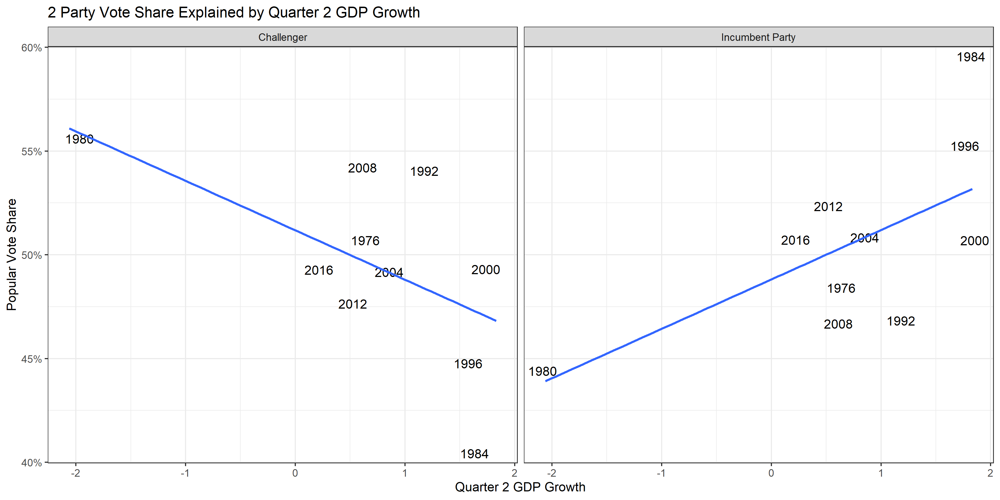
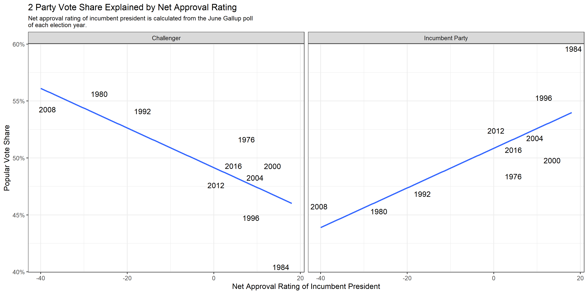
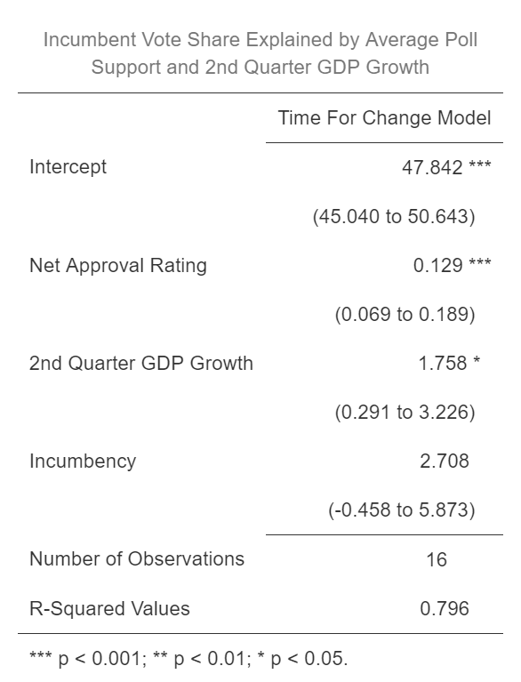
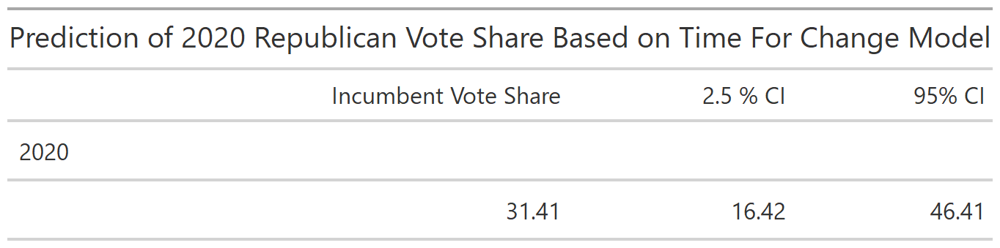

# Incumbency and Its Effects- Is It Time For A Change?

## October 5, 2020

When a president is campaigning for a second term in office, there are typically a number of benefits which analysts typically call the **“incumbency advantage.”** A few of these include an earlier start to fundraising efforts than their challengers, better access to campaign financing, a lack of competition in primaries, and the ability to use government resources and grants to indirectly leverage votes in key swing states or demographics.

However, to what extent does incumbency really play a role in election results? And how does it compare to other factors, such as GDP growth and polling, in its ability to accurately predict election outcomes? Today, I will be exploring these questions by examining one of the most popular election forecasting models: **Alan Abramowitz’s “Time For Change” model.** Though seemingly simplistic- only using 2nd quarter GDP growth, June Gallup Poll incumbent approval rating, and whether an incumbent is in office to predict election results- this model has been incredibly successful in predicting past elections. From 1992 to 2012, [the model’s outcomes were on average only 1.7 percentage points off from the actual election outcomes](https://pollyvote.com/en/components/models/retrospective/fundamentals-plus-models/time-for-change-model/), and in 2016 [this model was one of the few that predicted a narrow Trump victory.](https://www.nytimes.com/2016/05/11/upshot/voters-fears-about-trump-may-outweigh-wish-for-change.html) So what insight could the "Time For Change" model have to offer us in the current election cycle which seems so different from any other historical precedents? I will investigate this model and its 2020 predictions below.

## GDP Growth as a Predictor

Before looking at the model itself, I wanted to examine some of the various predictors included within the model on their own to test their predictive power. [A few weeks ago](https://eguetzloe.github.io/Election-Analytics-Blog/posts/02-blog.html), I explored how economic predictors can affect election outcomes, specifically looking at unemployment's predictive power. Though unemployment appeared not to be the greatest predictor of election results, GDP growth is often referenced as a powerful indicator of voter behavior in presidential elections. Thus, it comes as no surprise that Abramowitz includes GDP growth as one of the predictors in the "Time for Change" model. 

The graphic below looks at the relationship between Quarter 2 GDP growth and popular vote share for both candidates from incumbent parties and their challengers. The correlation is generally what we would expect to see regarding GDP growth and popular vote share- when 2nd Quarter GDP growth is up, incumbent parties gain greater percentages of the popular vote. When 2nd Quarter GDP growth is down, challengers accrue more of the popular vote.

## Gallup Approval Rating as a Predictor

Another major predictive variable within the "Time For Change" model is net incumbent approval rating based on the June Gallup poll in an election year. The June Gallup poll is the final Gallup poll about presidential approval taken before Election Day, so it marks the last available Gallup datapoint on approval ratings before the election. The correlation between net incumbent approval rating from the June Gallup poll and popular vote share for incumbent and challenger parties is illustrated below.

Again, the relationship shown in the graphic above is largely expected. When more people approve of the incumbent president than disapprove, the incumbent party tends to accumulate higher percentages of the popular vote. In contrast, when the sitting president is more heavily disapproved than approved of, the challenger party gains greater shares of the popular vote.

# Examining the "Time For Change" Model

Considering that the "Time for Change" model appears to use excellent predictors of electoral outcomes and has had such high rates of past accuracy, I was curious to investigate more about the model's predictive power. To do this, I created a dataset with all the variables necessary for running the "Time For Change" model in elections going back to 1948 and summarized the results of the model in the table below.

There are a number of key takeaways from this table. First, the net approval rating coefficient is the most statistically significant of all the coefficients- it would be interesting to explore further why this coefficient is so significant. Secondly, the R-squared values for this model are very high. The table indicates that nearly 80% of the variation in incumbent vote share that we see can be explained through this model- much better than some of the models examined in previous weeks. So, since this model seems so powerful, what happens when we apply it to the 2020 election cycle?

# 2020 Predictions

The results of the "Time For Change" model applied to the current election can be seen in the prediction table below.

According to the predictions made from this model, President Trump would be defeated by historic margins, earning only slightly over 31% of the popular vote. This is likely due to very low GDP growth from COVID-19 and lower approval ratings for President Trump. However, the confidence intervals for this model show that the model has a great deal of uncertainty- the lower bound of the prediction is approximately 16%, while the upper bound is around 46%. This is a **massive difference* in potential election outcomes! Additionally, based on current polling, it seems very unlikely that Donald Trump will earn no more than 30% of the popular vote. It appears that the "Time For Change" model, while highly effective at predicting past election outcomes, may not be the best model for dealing with such an unprecedented election cycle as 2020.

Though Abramowitz's "Time For Change" model may not be the best predictive model for the current election, exploring this model further shows that we must take a very different approach to 2020 than almost any past elections. Fundamentals-heavy approaches are likely to be unhelpful in predicting 2020 results in a world where economic fundamentals especially have been turned upside down. Thus, the work I have done with the "Time For Change" model this week tells me I should focus more heavily on polling-based approaches as I refine my models into Election Day. 