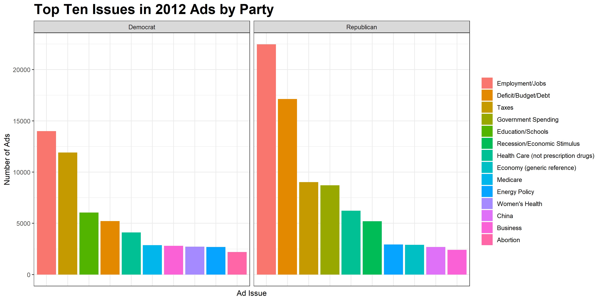
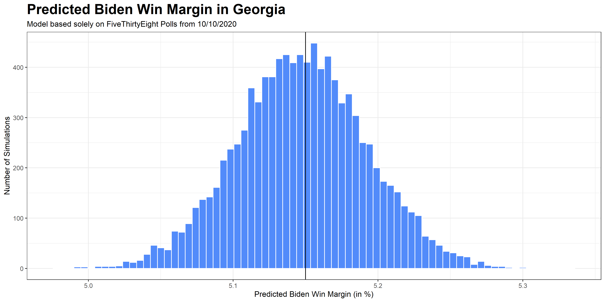
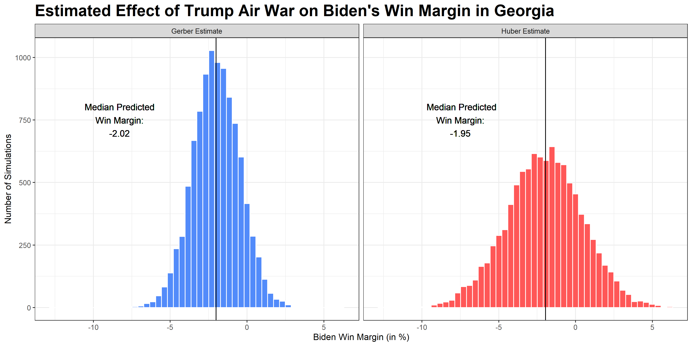

# Advertising- What's in an Air War?

## October 11, 2020

One of the most important aspects of a presidential campaign is the advertisements it airs. Campaigns must carefully consider **what types of ads they will air, what issues they will focus on most heavily, and what states they should air the greatest amounts of ads in. These decisions are what constitute the campaigns' air war.**

The top policy issues discussed in ads can vary by party, although some key issues are taken up in ads aired by both Republicans and Democrats alike. The graphic below illustrates this by exploring the top ten issues in ads for Barack Obama and Mitt Romney in the 2012 presidential race. In 2012, employment/jobs was the number 1 issue for both parties based on the amount of ads aired about that particular issue. Both parties used a significant number of ads to discuss taxes as well. Interestingly, education was the third most often aired issue in Democratic ads, but did not even break the top 10 in Republican ads. Similarly, Republicans' number 4 ad issue in 2012 was government spending, which did not break top 10 for Democratic ads. Both parties spent substantial amounts of ads on healthcare, energy policy, and business, but Democrats aired more ads on women's health, Medicare, and abortion, while Republicans used more ads to discuss the recession and economic stimulus, the general economy, and China.

## 2020 Air War

In 2020, when traditional ground-game campaigning like door-knocking  must be limited due to the COVID-19 pandemic, it is highly possible that the air war will become more important than ever before. As of October 9, 2020, Joe Biden has already [spent over $500 million on TV, digital, and radio ads for his election bid](https://www.cnbc.com/2020/10/09/joe-biden-hits-half-billion-dollar-mark-for-ads-in-trump-challenge.html). Most of these ads have been focused on voters in key swing states like Ohio, Iowa, Pennsylvania, Michigan, Florida, Wisconsin and Texas. In contrast, Donald Trump has struggled to maintain this steady stream of advertisements being released by his opponent. Recently, Trump [ended all advertisements in Ohio, Iowa, and New Hampshire](https://www.latimes.com/politics/story/2020-10-10/trump-biden-television-advertising-battleground-states), instead focusing remaining ad money on Florida, Georgia, Pennsylvania and North Carolina. 

It appears that as of now, Biden has a substantial funding lead over Trump, which has allowed Biden to keep advertising in a wide variety of key states. However, how much of an impact does this advertising edge actually give Biden on Election Day? More broadly, **how much does advertising actually change election results?** To explore this, let's create a hypothetical air war in one important 2020 swing state- Georgia.

## What Happens in a Georgia Air War?

Though the South has traditionally been a Republican stronghold due to Republican's "Southern Strategy" (which I explored further in a past [post](https://eguetzloe.github.io/Election-Analytics-Blog/posts/01-blog.html)), it appears that **many Southern states such as North Carolina, Georgia, and Texas [may be up for grabs in the upcoming presidential election](https://www.cnn.com/2020/10/06/politics/southeast-swing-states-2020/index.html).** 

As Southern states may be especially important states to watch in the upcoming election, I wanted to study Georgia further and see what could happen if Trump decided to focus an onslaught of ads on this state. **I therefore decided to simulate a hypothetical "ad war" that could occur between Biden and Trump over Georgia.**

To do this, I started by checking FiveThirtyEight for the most recent average polling of Biden and Trump in Georgia. As of now, it appears that the two candidates are essentially neck-to-neck: Biden leads by only 0.2 percent. With these kinds of razor-thin margins, I wondered what could happen if Trump decided to heavily focus his resources on winning the state. 

I used these polling averages to create a binomial logistic model of voter turnout for each party. The model was based solely on historical polling data in Georgia from approximately the same amount of time before Election Day as we are at now- about 5 weeks out. **Since polling is the only predictor, and, as 2016 revealed, polling can be somewhat misleading, this model's predictions should be considered with an appropriate level of uncertainty.** However, they can provide us with at least a basic idea of what might happen in Georgia this election cycle based on past polling records and voter turnout by party.

According to my model, Biden is predicted to win Georgia by about 5 percentage points. The graph below illustrates the results of 10,000 simulations of the model, with Biden's lead consistently falling between 5.0-5.3% and his median predicted win margin being 5.15%.

If this model is correct, Trump would need to gain about 5 points to make this race a toss-up and would need to gain approximately 7 points to gain a 2% win margin. So could Trump wage a massive air war in Georgia and make up this lost ground? Some researchers say yes. 

Many political scientists have attempted to measure the effects of a set amount of "gross rating points" or "GRPs," which represent the percent of reachable voters multiplied by the amount of aired advertisements. **Gregory A. Huber and Kevin Arceneaux estimate that 1,000 GRPs can buy a 7.5% shift in the popular vote, while Alan S. Gerber, James G. Gimpel, Donald P. Green, and Daron R. Shaw find that 1,000 GRPs can buy a 5% shift in the popular vote.** Gerber et al. also estimate that 1 GRP in Pennsylvania would cost $300. Although that price may not be the same for every state, I have assumed for the sake of this analysis that 1 GRP in Georgia would cost the same as a GRP in Pennsylvania.

The graphic below illustrates 10,000 simulations of the same Georgia election, but conducted after Trump spent the different amounts of money estimated by Huber et al. and Gerber et al. as necessary for winning him a 2% margin of victory in Georgia. Based on my analysis above, I assumed that Trump would need to gain about 7.15 percentage points from his current place in the polls to have a win margin of at least 2%. Huber et al.'s research claims that Trump would need approximately 953.3 GRPs to win 7.15 points in Georgia for a total cost of $286,000, while Gerber et al.'s research finds that Trump requires 1,430 GRPs which would cost $429,000 in order to win Georgia.

**Importantly, the simulations shown in the plot above reveal that even with the influx of Trump ads in Georgia and the assumption that Biden's amount of advertising would remain constant, a Biden victory would not be impossible.** Though the addition of 1,430 GRPs for the Gerber simulations gives Trump a median predicted win margin of 2.02%, the model shows Biden still being able to pull off possible win margins of about 2.5-3%. If Huber's analysis is accurate, things look even worse for Trump. Even with the added 953 GRPs estimated to give him a 2% win margin (and a new median predicted win margin of 1.95%), the graph still shows hundreds of simulations where Biden could win. Some of these simulations even give Biden over a 5% win margin.

**According to this analysis, even if the Trump campaign spent the amounts of money calculated by Gerber et al. and Huber et al. as necessary for gaining a 2% win margin, and even if the Biden campaign did not respond in kind but merely continued advertising as before, a Trump victory in Georgia would not be certain.** This seems to indicate a solid Biden advantage in Georgia. However, current polling and past electoral results in Georgia cast doubt on this narrative. Georgia has voted Republican since 1996, and even though Biden is fighting hard to turn Georgia blue, Trump has been doubling down on his efforts to keep the state red. It will be exciting to see whether Biden and Trump actually engage in a true air war over the coming month to win Georgia. If they do, it may be possible to test whether these ads made a real difference in results in the aftermath of the upcoming election.