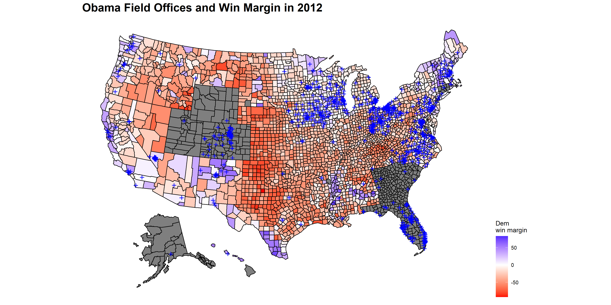
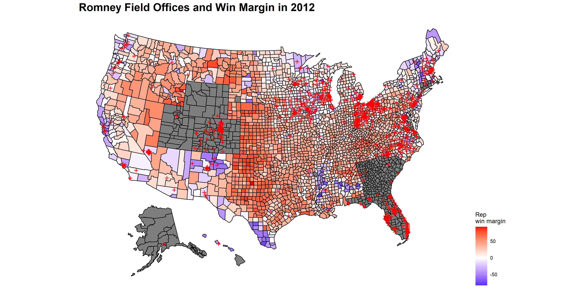
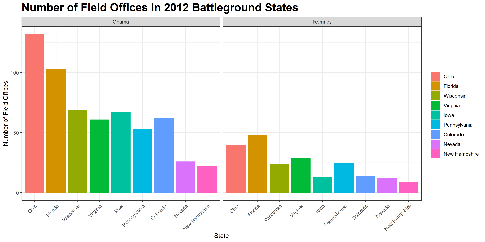
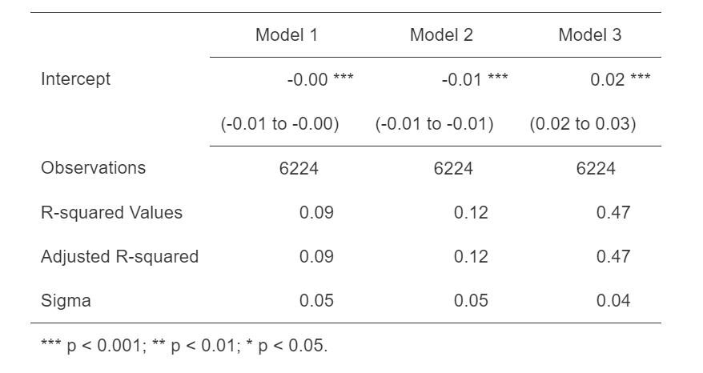

# Ground Game- How Far Does Grassroots Really Go?

## October 18, 2020

In election analytics, the most common focuses going into elections tend to be polling or fundamentals like the economy, incumbency, and partisanship. However, such a focus can turn attention away from another critical piece of campaigning- the ground game. In every presidential election, campaigns must set up field offices across the country, which are used as local bases for contacting voters and mobilizing supporters.

Since the ground game looks a little different this year than most (Joe Biden, for instance, opted to [stop engaging in door knocking](https://www.npr.org/2020/09/13/911460651/republicans-are-knocking-on-doors-democrats-arent-biden-s-campaign-says-that-s-o]) entirely due to the COVID-19 pandemic) and data on the ground game is sparse, I will focus today on **examining the impact of field offices in the past.** Then, I'll use a simple linear regression to model how numbers of field offices can impact Democratic vote shares. 

## 2012 Ground Game

In 2012, Obama's campaign had 682 more field offices than Romney. This number is significant, and is arguably one of the reasons why Romney lost to Obama in that election. To explore this distinction further, I have mapped out the locations of field offices for both of the candidates in comparison to their win margin county by county. Unfortunately, some county vy county popular vote data is missing, so states where this data was unavailable will be gray.

The map above illustrates Obama's field offices vs. his win margin in 2012. **Most of the field offices are clustered around traditional battleground states**, like Ohio, Florida, Colorado, Wisconsin, and Pennsylvania. However, it is interesting to observe that there are **clearly many more field offices along the New England seaboard- traditionally more of a Democratic stronghold- than in states known to consistently vote red.** Even the few field offices which exist in Texas, are located in districts that appear blue and seem to be located near cities like Houston.

This map shows Romney's field offices plotted against his 2012 win margin. Compared to the map of Obama's field offices, it **quickly becomes evident that Romney had significantly fewer field offices than Obama.** While Romney also focused on battleground states, he was not able to also pursue a strong network of field offices in Republican stronghold states as Obama did for Democratic strongholds. Surprisingly, it appears that Romney did not have a single field office in Texas. It would be interesting to do some further exploration of whether this less robust ground game in Republican strongholds had an impact on the outcome of the 2012 election.

To further explore the 2012 ground game, I made a simple bar graph charting the numbers of field offices for both candidates found in major 2012 battleground states. Again, **the much larger numbers of Obama field offices is very clear.** In Ohio, the battleground state where Obama had the most field offices and Romney the second most, Obama appeared to have nearly triple the amount of field offices. In Florida, which was the battleground state with the most Romney offices, Obama still appears to have about double the number of Romney offices. **In every state, Obama had more field offices, and in all states but New Hampshire and Nevada, the battleground states where each candidate had the fewest field offices, Obama had substantially higher proportions of field offices than Romney.**

## Modeling the Ground Game Impact

Considering Obama's much higher numbers of field offices and his win in 2012, it seems reasonable to ask **how much having more field offices and a strong ground game impacts the results of an election.** To try to answer this question, I created a few models testing the impact of changing numbers of field offices on Democrats' vote percentages in elections from 2004 to 2012. The first model only uses a dummy variable of field office change to analyze the impact on Democratic vote share. The second model incorporates an additional battleground variable and an interaction between whether a state was a battleground and the original field office dummy variable. The final model uses all of the predictors and interactions from the previous model plus a state and year variable. The results of each model and leave-one-out cross validation are shown in the table below.

As can be observed from the very low R-squared and adjusted R-squared values of the first model, **the model with only the number of field offices dummy variable appears to be a poor predictor of Democratic vote share.** The second model's R-squared values are only slightly better than the first, which tells me that **the interaction did not do much to improve the overall predictiveness of this model.** Adding in the state and year variables, while still not creating a very predictive model, did cause the R-squared values to jump pretty substantially. **In combination with other variables, then, it is possible that the inclusion of a field offices variable could be helpful for predictive models.**

When I think ahead to my final prediction model, I am not sure that the use of field offices or other ground game measures will be as helpful in this election cycle as it might be in other years. With the COVID-19 pandemic and resulting limitations on typical ground game activities, I'm not sure that ground game variables would be the best choice to include in my final model. Even in other years without these unprecedented circumstances, there is not a lot of data on the number of field offices. The models I created, for instance, were only able to rely on data from three election cycles. **Until more data is collected on field offices, I will probably avoid using ground game metrics in my models.**
