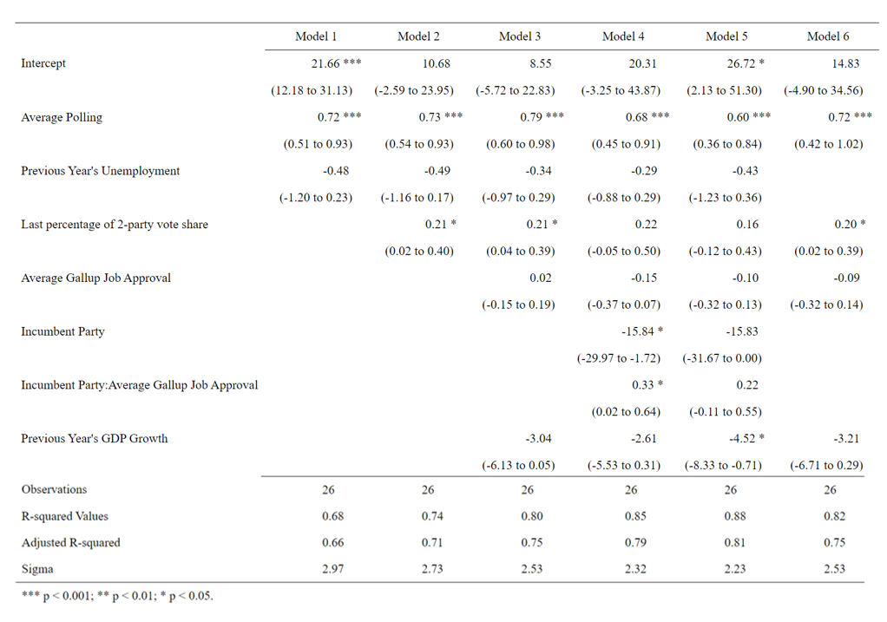
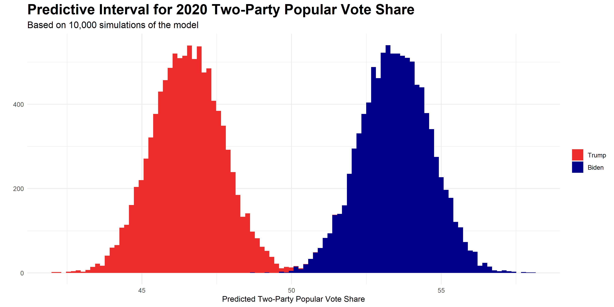
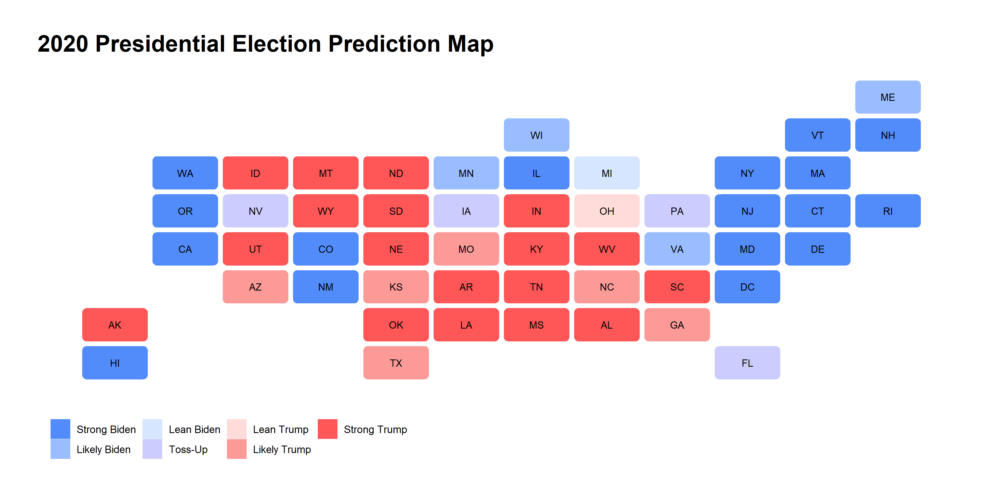
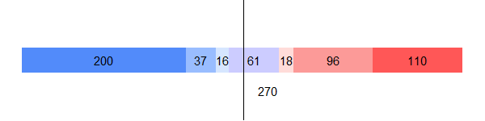
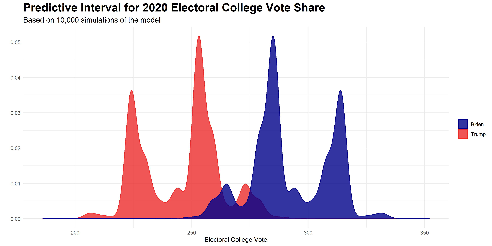
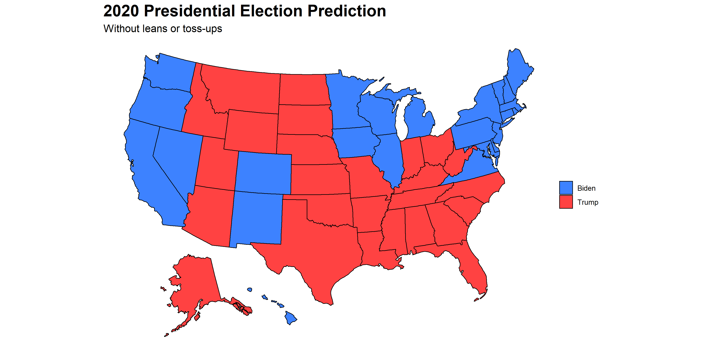

# Final Prediction- Who Wins?
## November 1, 2020

Finally, it's the moment we've all been waiting for! Tuesday, November 3rd, is rapidly approaching, and with it all the work I have done this semester in testing predictive models comes to a close. This week, I developed two final models for predicting the national popular vote and the Electoral College vote for the 2020 presidential election.

## National Popular Vote Model

To develop a model for predicting the national popular vote, I built six different training models. I tested which models had the highest overall R-squared values while also maintaining a comparatively low root mean square error (RMSE) and a decently high R-squared value following leave-one-out validation. The outputs of the six models can be viewed in the table below:

I tested a variety of models with a number of different predictors and interactions, as can be seen in the table above. However, ultimately the best model overall proved to be model 4. This model had relatively high R-squared and adjusted R-squared values but also held up well under leave-one-out cross-validation (LOOCV) testing. The RMSE for this model was comparatively not very high and its leave-one-out R-squared value still explained a significant portion of the variance in the data. Because it provided relatively high R-squared and adjusted R-squared values while still maintaining a lower RMSE and a higher LOOCV R-squared value, it appeared that **this model could perform well with both in and out-of-sample testing.**

The formula for the model I settled on for predicting the national popular vote was:

`lm(pv2p ~ avg_support + prev_avg_unemployment + prev_avg_gdp_growth + last_pv2p + incumbent_party*job_approval)`

The predictors I used for my national model were:

1. **Average Poll Support:** I chose to **include all polls from June 2020 forwards.** At this point, it was obvious that both candidates would be the nominees of their respective parties, and other former Democratic candidates had largely coalesced around Joe Biden as the Democratic nominee. I then took the average of all FiveThirtyEight polls from June onwards to create an average national support variable. Though FiveThirtyEight also creates grades for different polls which I could have included as weights, I chose not to include any weights for polls because I did not notice a significant difference in model outputs when polls were weighted and when they were not.

2. **Previous Year's Average Unemployment Rate:** I have explored average unemployment rates as a predictor in a couple of different blogs earlier in the year (see weeks [2](https://eguetzloe.github.io/Election-Analytics-Blog/posts/02-blog.html) and [3](https://eguetzloe.github.io/Election-Analytics-Blog/posts/03-blog.html) for more details on unemployment specifically). While unemployment on its own at first appeared to be a poor predictor, it was actually a strong predictor when combined with other variables such as polling. I wanted to include some type of economic predictor, but I was skeptical of using 2020 economic data due to the havoc wreaked on almost all of 2020's traditional economic indicators by COVID-19. Thus, I decided to look at the **national average unemployment rate for each year before an election year.** This might not be as traditional of an economic predictor, but I reasoned that it might be one of the best ways to include some kind of economic indicator into a 2020 model. It is almost certain that voters are still thinking about economics despite the impact of COVID, but the question of how to include economic data in 2020 is a question which many forecasters are struggling to answer.

3. **Previous Year's Average GDP Growth:** In addition to the national average unemployment rate, I also included the **average GDP growth for the year prior to an election year.** Again, I was concerned about including 2020 economic data so I focused on the years prior to election years. Similar to the last predictor, I took the average rate of GDP growth for every year before a presidential election. GDP growth is a classic election predictor, so I chose to include it in my model.

4. **Last 2-Party Presidential Popular Vote Share:** One of the best ways to predict how people will act in the future is by looking at how they have acted in the past. With this in mind, I added in the **last election's 2-party national popular vote share** as a predictor variable.

5. **Interaction of Incumbent Party With Incumbent Job Approval:** There were two final predictor variables I chose to include in the model. The first was a **dummy variable which noted whether a presidential candidate was a member of the incumbent party or not.** Since candidates from incumbent parties traditionally receive a level of advantage in elections (see my [week 4 blog](https://eguetzloe.github.io/Election-Analytics-Blog/posts/04-blog.html) for more details on this), I thought this variable would be important to include within my model. While incumbent party on its own would certainly be an important variable to include, I thought it was **highly probable that incumbency's total effect is moderated by people's perceptions of the incumbent president's job performance.** If people generally approve of the current president, they will probably be more likely to vote for the candidate from the incumbent party. If the public shows more disapproval of the current president, it is likely that the incumbent party will fare worse in the upcoming election. Thus, I ultimately decided to **interact the incumbent party dummy variable with Gallup poll statistics about job approval of the current president.** I chose to only use Gallup job approval polls from election years and specifically within the months before the election- January through October.

**Importantly, I did not include any variables which specifically accounted for the impact of COVID-19.** Though I explored some possibilities for thinking of COVID within electoral forecasting in [last week's blog](https://eguetzloe.github.io/Election-Analytics-Blog/posts/07-blog.html), there was no easy way to do this which could clearly aid in election prediction. Thus, I chose not to include any data on COVID-19 in my final model.

After choosing the model, I then ran 10,000 different simulations to find the predictive interval for the two-party national popular vote. The graphic below illustrates the results of these simulations.

As can be seen in the plot, **my model predicts Biden gaining about 53% and Trump gaining about 47% of the national popular vote.** Thus, the model forecasts a **solid Biden lead in the popular vote.** It is important to note, however, that there is **still uncertainty within the model's predictions**- while the largest proportions of predicted vote shares centered around the values listed above, there were also many simulations where either the race was tighter or where the race gave Biden an even stronger lead. Thus, I believe the main focus when interpreting the results of this model should simply be that it **predicts a Biden victory in the national popular vote.** 

## State-By-State Electoral College Model

For my second model, I focused on predicting the outcomes of individual states and thus the results of the Electoral College vote. Similar to the process of creating my national popular vote model, I also tested multiple different models with a variety of predictors and interactions before deciding on the best possible model. As I did for the national model, I again assessed the models based mostly on R-squared values, adjusted R-squared values, and RMSE. 

One change for these models, however, was my creation of an "average R-squared value" for all states following the use of leave-one-out cross-validation (LOOCV) testing. After running the models and testing them using LOOCV, the models would output separate R-squared values for every state. Thus, I opted to average all of these state R-squared values for each model to see which model still achieved the highest average R-squared value for all states following LOOCV tests.

In total, I tested 15 different models before settling on one. My final model for predicting state votes and thus the winner of the Electoral College was:

`lm(pv2p ~ avg_support*party + prev_avg_gdp_growth + last_pv2p + job_approval*party)`

Many of the predictors I used for this model were similar to those used in the national model, but for the sake of clarity here is a full explanation of all variables chosen:

1. **Interaction of Average Poll Support with Incumbent Party:** As I did for the national popular vote model, I again used average poll support as one of my predictors. However, this time I aggregated polls by state and then averaged from there, rather than simply taking a national average as I did for the previous model. Thus, it might be better to think of this variable as **average state poll support.** However, for my state model, I ended up **interacting average state poll support with my incumbency dummy variable.** Similar to the interaction used in the national model, I hoped that this interaction would represent the way in which views of the candidate from the incumbent party are affected by public perceptions of the candidates through general polling. However, this interaction focused more on polls about both the candidates rather than on incumbent president's job approval alone.

3. **Previous Year's Average GDP Growth:** To account for voters' economic concerns while still keeping in mind that COVID has significantly impacted traditional economic predictors, I again employed the **average GDP growth from the year prior to an election** as a predictor in my state model.

4. **Last 2-Party Presidential Vote Share By State:** As I did in the national model, I again incorporated a variable accounting for the last presidential election's 2-party vote share. However, since this model was specifically predicting state votes, I used **each state's previous vote share for each party** as a predictor for each state's vote in the upcoming election.

5. **Interaction of Incumbent Party With Incumbent Job Approval:** This interaction was the same as the one used in the national model- **an interaction of the incumbency dummy variable with national job approval ratings from Gallup polls.**

After running this model, I developed the map below. This map shows my model's predictions for which way states will vote in the 2020 presidential election, including a variety of levels to account for the strength of a state's vote for a particular candidate. The levels I created were "Strong Trump", "Likely Trump", "Lean Trump", "Toss-up", "Lean Biden", "Likely Biden", and "Lean Biden." These levels were based on the predicted win margin of candidates in each state.

There are a number of key takeaways from this model. First, my model predicts that **the biggest toss-up states will be Florida, Iowa, Nevada, and Pennsylvania. Michigan and Ohio are the only states which fall into my "lean" category**, with Michigan being predicted to "lean Biden" and Ohio predicted to "lean Trump." Secondly, there are a few outcomes which might be surprising based on comparisons to other prominent predictive models like [FiveThirtyEight](https://projects.fivethirtyeight.com/2020-election-forecast/) and [the Economist](https://projects.economist.com/us-2020-forecast/president). **Notably, my model does not predict Arizona, Georgia, North Carolina, Texas, or Wisconsin being toss-up or even lean states.** Instead, Arizona, Georgia, North Carolina, and Texas are all categorized as "likely Trump" states, while Wisconsin is predicted to be "likely Biden."

The bar below aggregates the predicted Electoral College vote shares for each of the candidates based on the win margin categories for states.

**My model predicts 253 electoral votes going to Biden and 224 electoral votes going to Trump, with 61 electors up for grabs in toss-up states.** But as I discussed earlier with my national popular vote model, we must keep in mind that these results are not the only possibilities for the election's outcome. To better visualize the inherent uncertainty of the model, I again ran 10,000 simulations of my state-level model to predict the expected Electoral College vote share for Biden and Trump. The predictive interval for the model is shown in the graphic below.

**The key takeaway from this graphic is that Biden is clearly favored to win the Electoral College.** Biden's expected Electoral College vote share centers somewhere around the 290 mark, while Trump's Electoral Vote appears to center near 250. However, the simulations also indicate that a stronger Biden victory where Biden accumulates over 300 electoral votes is very possible. The model foresees almost no situations where Biden gains well over 325 electoral votes.

**Importantly, while the model forecasts an Electoral College victory for Biden, it is not impossible for Trump to pull off a win.** Trump won 934 of my 10,000 simulations, meaning he won about 9.3% of the model's simulations. This is not an unsubstantial percentage, and we should not be completely surprised if Trump does manage to win the Electoral College.

But what happens when we remove all "lean" or "toss-up" categorizations and instead make simple predictions based on who will win a higher 2-party vote percentage in each state? The results of my state model's final predictions can be observed in the "no-lean" map below.

The main observation from this map is that **Biden is predicted to win 3 out of my 4 toss-up states- namely, Iowa, Nevada, and Pennsylvania.** My model predicts that Florida will be especially close, with Trump barely winning the state by under half a percentage point. If my model is correct, **Biden will pull off a relatively narrow victory in the Electoral College, ultimately gaining 285 electors to pass the 270 margin by 15 votes.** This is a **much smaller margin of victory for Biden than many major analysts have predicted.** That being said, few analysts in 2016 predicted how tight the race between Trump and Clinton would be, so it will be interesting to find out whether pollsters again underestimated levels of support for Trump in this election.

It is unclear whether we will know the winner of the 2020 presidential election by this Tuesday night. With [greater numbers of mail-in ballots than ever before and predictions of high voter turnout](https://www.nytimes.com/interactive/2020/us/elections/early-voting-results.html), it may take days or even weeks before we are completely certain about the outcome of this election. Excluding the possibility of a blowout for one candidate for the other- which my model does not predict- it will likely take time for full election results to roll in. However, **I predict that once all is said and done in this election, Biden will win both the popular vote and the Electoral College, making him the next president of the United States.**